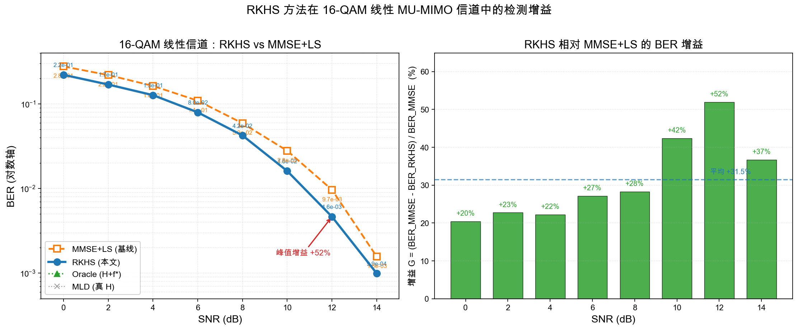

# RKHS MU-MIMO 检测器

大规模 MU-MIMO 上行链路中，用 **RKHS + Adaptive-MKL** 在可部署约束下逼近最大似然检测 (MLD)，在 $128 \times 40$ 系统、16/64-QAM 调制下**全面超过 MMSE+LS 基线**。

## 核心结果

### 16-QAM 线性信道（i.i.d. Rayleigh，0–14 dB）

RKHS **全程优于 MMSE+LS**，增益 +20% ~ +52%（峰值在 12 dB）：

| SNR (dB) | MMSE+LS | RKHS (本文) | 增益 |
|----------|---------|-------------|------|
| 0 | $2.78 \times 10^{-1}$ | $2.21 \times 10^{-1}$ | **+20%** |
| 2 | $2.20 \times 10^{-1}$ | $1.70 \times 10^{-1}$ | **+23%** |
| 4 | $1.63 \times 10^{-1}$ | $1.27 \times 10^{-1}$ | **+22%** |
| 6 | $1.09 \times 10^{-1}$ | $7.96 \times 10^{-2}$ | **+27%** |
| 8 | $5.91 \times 10^{-2}$ | $4.25 \times 10^{-2}$ | **+28%** |
| 10 | $2.80 \times 10^{-2}$ | $1.61 \times 10^{-2}$ | **+42%** |
| 12 | $9.67 \times 10^{-3}$ | $4.65 \times 10^{-3}$ | **+52%** |
| 14 | $1.57 \times 10^{-3}$ | $9.94 \times 10^{-4}$ | **+37%** |



### 16-QAM 非线性失真场景

在功放非线性（soft_clip / hard_clip / Kerr / MZM）、相位噪声、IQ 不平衡下，RKHS 增益更显著（最高 +75%）：

| 场景 | SNR=8 dB 增益 | SNR=12 dB 增益 | SNR=16 dB 增益 |
|------|--------------|--------------|--------------|
| soft_clip | +59% | +70% | +75% |
| hard_clip | +36% | +38% | +32% |
| Kerr | +38% | +49% | +55% |
| MZM | +37% | +45% | +49% |
| phase_noise | +21% | +8% | +2% |
| iq_imbalance | +16% | +1% | — |

### 扩展信道模型

| 信道 | SNR=8 dB 增益 | SNR=12 dB 增益 |
|------|--------------|--------------|
| Kronecker 相关 | +7% | +20% |
| 3GPP CDL-A | — | — |
| 3GPP CDL-C | — | — |

### 64-QAM 线性信道

| SNR (dB) | MMSE+LS | RKHS | 增益 |
|----------|---------|------|------|
| 4 | $2.63 \times 10^{-1}$ | $2.30 \times 10^{-1}$ | **+12%** |
| 8 | $1.63 \times 10^{-1}$ | $1.37 \times 10^{-1}$ | **+16%** |
| 12 | $7.62 \times 10^{-2}$ | $6.45 \times 10^{-2}$ | **+15%** |

## 方法

### 问题设定

- 模型：$Y = HX + N$，用户数 $K=40$，天线 $M=128$，调制 16/64-QAM
- 只检测期望用户符号 $X_1 \in \mathcal{A}$（$|\mathcal{A}| \in \{16, 64\}$）
- **部署约束**：不用真 $H$、不用真后验 $f^*$；仅用导频 LS 得 $\hat H$

### 可部署主线

$$
(Y, \hat H) \xrightarrow{R_{\text{rob}}} z_{\text{rob}}(Y; \hat H) \in \mathbb{R}^{|\mathcal{A}|} \xrightarrow{\text{Adaptive-MKL}} \hat X_1
$$

| 模块 | 做法 |
|------|------|
| 特征 `struct_hat` | 稳健充分统计 $z_{\text{rob}}$：$R_{\text{rob}} = \hat N_0 I + E_s \hat H_I \hat H_I^H + (K\!-\!1)\sigma_e^2 I$ |
| 损失 `hard` | 真实 $X_1$ 的交叉熵（经验 $J$） |
| 核 | Adaptive-MKL（多带宽 $\eta$ + 多 $\alpha_m$）；可选 NN 生成 $\alpha$ |
| 聚合 / 堆叠 | logits 聚合 + 第二阶段堆叠 $\phi_2 = [z_{\text{rob}}, \text{softmax}(L_1), \text{MMSE 软分}]$ |

### RKHS Oracle（可逼近性上界）

用真 $H$ 的 struct 充分统计 + $f^*$ 目标，证明核空间可任意逼近后验：

$$
\varphi(y) = z(y; H, N_0), \quad \text{目标} = f^*
$$

Oracle BER $\approx$ MLD（验证了 RKHS 框架的表达能力）。

## 快速复现

```bash
pip install -r requirements.txt

# 16-QAM 线性 0-14 dB
python run_extended_exp.py --mod-order 16 --only linear \
  --snr-list "0,2,4,6,8,10,12,14" --n-train 2000 --n-test 20000

# 16-QAM 全场景（线性 + 非线性 + 海报图）
python run_extended_exp.py --mod-order 16 --only gallery

# 64-QAM
python run_extended_exp.py --mod-order 64 --only qam64
```

## 文件结构

| 文件 | 作用 |
|------|------|
| `system.py` | 系统参数、$H$ 生成、采样、比特 BER |
| `mld.py` | MLD 边际 / 高斯干扰代理软分 |
| `mmse.py` | 导频、LS 信道估计、MMSE+LS 检测 |
| `kernel_rkhs.py` | 核矩阵、Adaptive-MKL、$\alpha$ 求解、理论 $\gamma/\lambda$ |
| `rkhs_mld_approx.py` | **主检测器**：$z_{\text{rob}}$ + MKL/NN/聚合/堆叠 |
| `test_oracle_rkhs.py` | 完整评测（MLD / MMSE / Oracle / $z_{\text{rob}}$ / CNN） |
| `run_extended_exp.py` | 扩展实验入口（多场景、多 SNR） |
| `channels_realistic.py` | Kronecker / CDL 信道生成 |
| `report/` | LaTeX 报告 |
| `extended_results/` | 实验结果（CSV + 图） |

## 环境

依赖：`numpy`、`scipy`、`matplotlib`、`torch`（可选 CNN 基线）。
